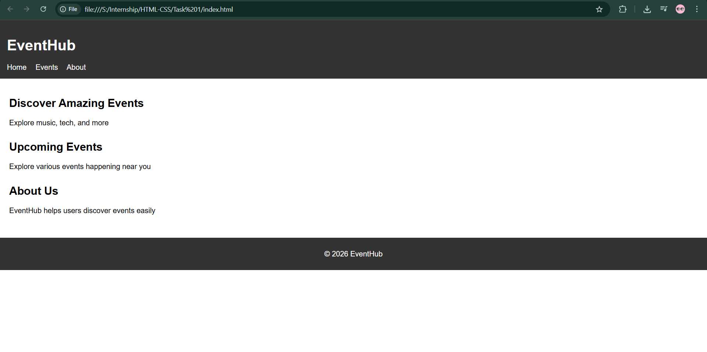
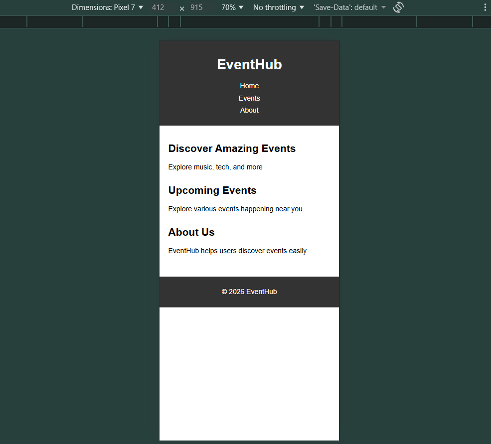

# HTML-01 : Static Webpage Layout

## Objective
Create a single-page website using semantic HTML elements like header, nav, main, and footer. Apply basic CSS styling and make the layout responsive.

---

## What I Implemented

- Used semantic HTML tags:
  - `<header>`, `<nav>`, `<main>`, `<footer>`
- Created sections:
  - Home (Hero section)
  - Events section
  - About section
- Added CSS for:
  - Typography (font, colors)
  - Spacing (margin and padding)
- Implemented responsive design using media queries
- Added viewport meta tag for proper mobile rendering

---

## Output

### Desktop View

### Mobile View
