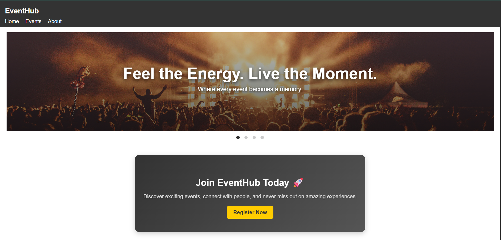
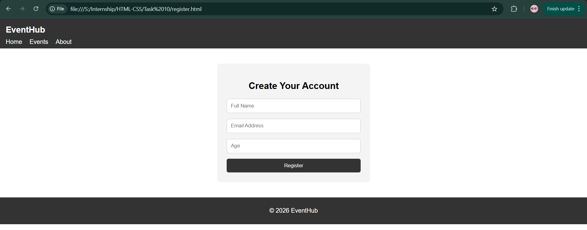

# HTML-10 · Interactive Multi-Page Website Simulator

## 🎯 Objective
Create a fully functional multi-section website that simulates navigation between different pages using only HTML and CSS, without any JavaScript.

---

## 🚀 What I Implemented

- Built a multi-page simulation using the `:target` pseudo-class to control page visibility.
- Structured each section (Home, Events, Gallery, FAQs, About) as independent "pages".
- Implemented conditional rendering using `:target` and `:has()` to manage default and active states.
- Added smooth page transitions using CSS animations (fade + slight movement).
- Maintained a consistent navigation system across all pages.
- Combined **Flexbox (navbar)** and **Grid (content + sidebar layout)** for responsive design.
- Added a CTA section in the Home page encouraging users to register
- Created a separate `register.html` page with a simple form (Name, Email, Age)
- Maintained consistent UI by reusing header and footer across pages
- Implemented basic form validation using HTML (`required`, `type="email"`)
- Added a success alert on form submission
- Enabled navigation back to SPA sections using `index.html#id`

---

## 🧠 Key Learnings

- Used CSS pseudo-classes like `:target` and `:has()` to manage UI state without JavaScript.
- Understood how to simulate multi-page navigation by showing/hiding sections instead of scrolling.

---

### Limitations

- Navbar and footer are duplicated across multiple HTML files due to lack of component reuse in pure HTML/CSS.
- Form handling is basic and does not include data persistence or backend integration.

## 📸 Output

###  Home Page with CTA section

### Events Page (Content + Sidebar)

###  Gallery Page

###  FAQ Page

### About Page

#### Register Page
