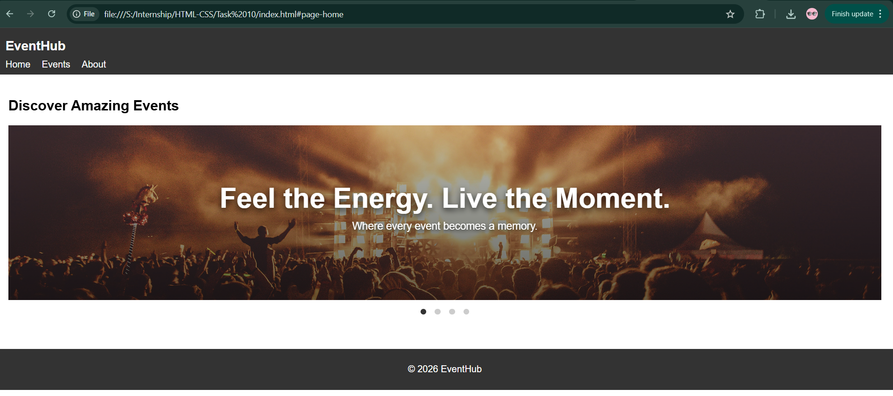
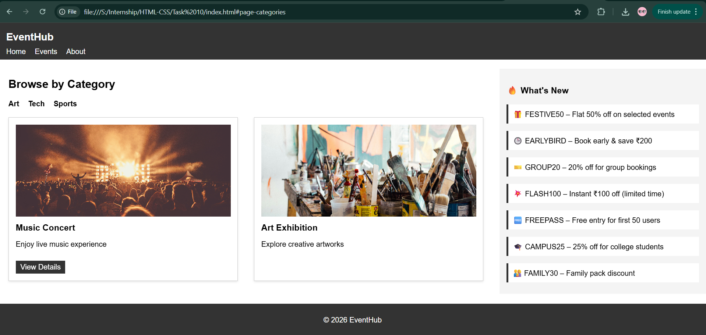
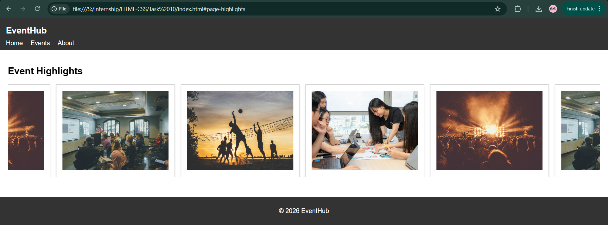
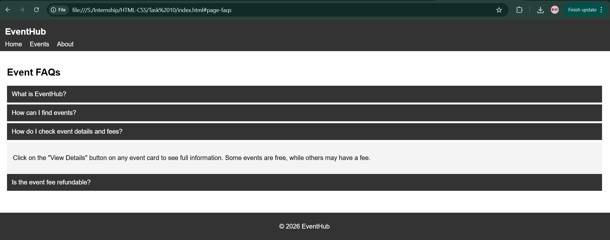
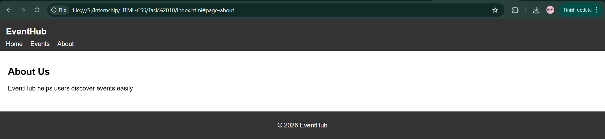

# HTML-10 · Interactive Multi-Page Website Simulator

## 🎯 Objective
Create a fully functional multi-section website that simulates navigation between different pages using only HTML and CSS, without any JavaScript.

---

## 🚀 What I Implemented

- Built a multi-page simulation using the `:target` pseudo-class to control page visibility.
- Structured each section (Home, Events, Gallery, FAQs, About) as independent "pages".
- Implemented conditional rendering using `:target` and `:has()` to manage default and active states.
- Added smooth page transitions using CSS animations (fade + slight movement).
- Maintained a consistent navigation system across all pages.
- Combined **Flexbox (navbar)** and **Grid (content + sidebar layout)** for responsive design.
- Reused components from previous tasks:
  - Hero carousel (radio `:checked`)
  - Tabbed content (radio `:checked`)
  - Accordion (checkbox `:checked`)
  - Modal popup (`:target`)
- Ensured responsive behavior using media queries.

---

## 🧠 Key Learnings

- Used CSS pseudo-classes like `:target` and `:has()` to manage UI state without JavaScript.
- Understood how to simulate multi-page navigation by showing/hiding sections instead of scrolling.

---

## ⚠️ Limitations

- Browser back/forward navigation is not fully reliable due to hash-based routing.
- Page state resets on refresh since no JavaScript is used.

---

## 📸 Output

###  Home Page

### Events Page (Content + Sidebar)

###  Gallery Page

###  FAQ Page

### About Page
