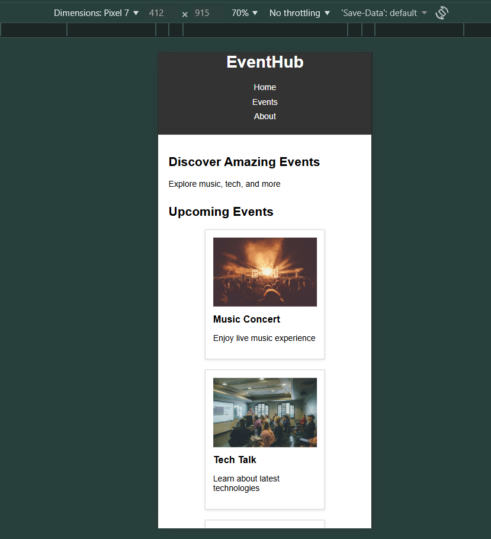

# HTML-02 : CSS Card Component with Hover Effects

## Objective
Build a card component with image, title, and description. Apply styling and add hover effects.

---

## What I Implemented

- Created event cards with:
  - Image
  - Title
  - Description
- Styled cards using:
  - Border
  - Padding
  - Box-shadow
- Added hover effect:
  - Scale transform
  - Background color change
- Used Flexbox to arrange cards in a row
- Implemented responsive design:
  - Cards stack vertically on smaller screens

---

## Output

### Desktop View

### Mobile View

