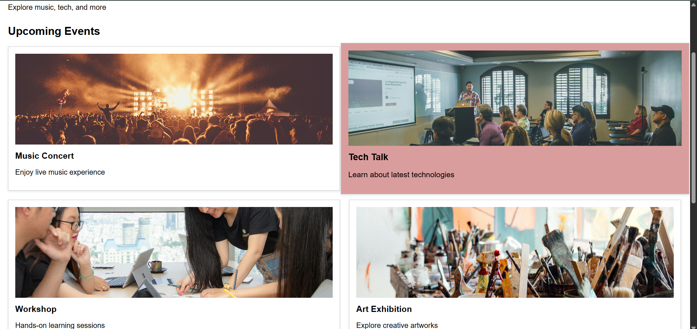
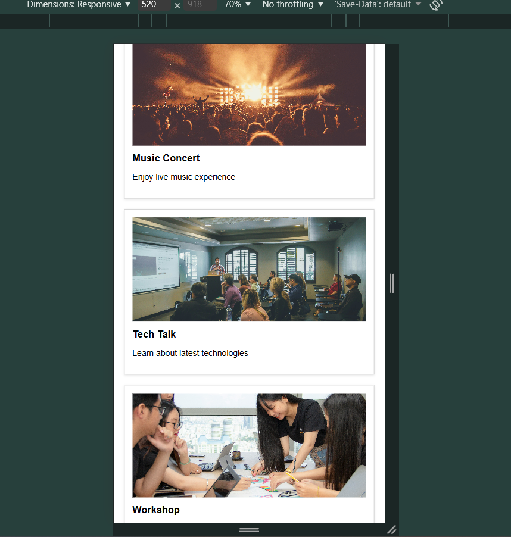

# HTML-03 : Responsive Grid Layout

## Objective
Build a grid layout to display multiple event cards. Make it responsive for different screen sizes.

---

## What I Implemented

- Displayed 6 event cards with:
  - Image
  - Title
  - Description
- Replaced Flexbox with CSS Grid
- Arranged cards in rows and columns using grid
- Added spacing using gap
- Updated image styling:
  - Fixed height for uniform cards
  - Used object-fit: cover for clean display
- Implemented responsive design:
  - 2 cards per row on desktop
  - 1 card per row on smaller screens

---

## Output

### Desktop View

### Mobile View
