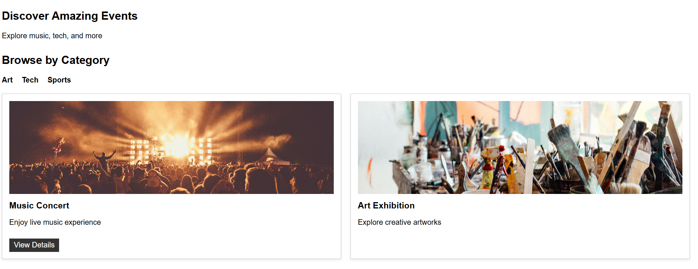
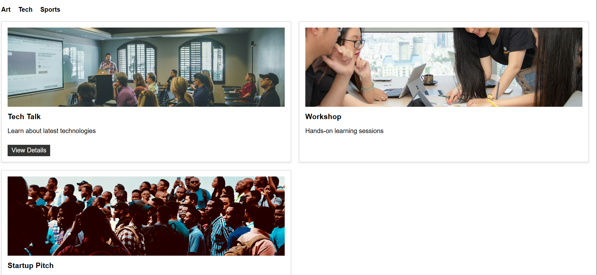

# HTML-06 : Tabbed Content Interface using CSS

## Objective
Create a tabbed interface where clicking on a tab displays different content sections without using JavaScript.

---

## What I Implemented

- Built a tab system using hidden radio buttons
- Used labels as clickable tabs (Art, Tech, Sports)
- Applied `:checked` pseudo-class to control content visibility
- Displayed category-based event cards inside each tab
- Reused existing card layout (CSS Grid)
- Ensured only one tab content is visible at a time

---

## Output

### Art Tab

### Tech Tab

