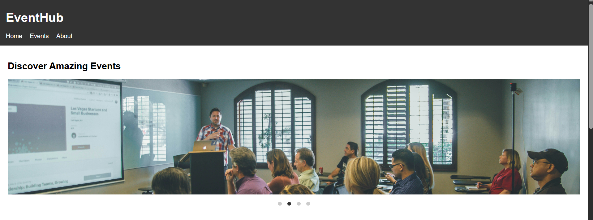
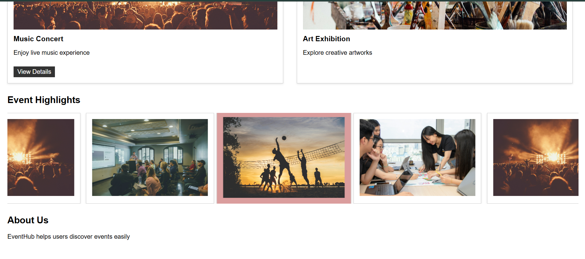

## Objective
Implement a carousel in the hero section and an infinite scrolling gallery for event highlights.

## What I Implemented
- Built a manual image carousel using radio buttons and :checked pseudo-class
- Implemented navigation dots for slide selection
- Created an infinite scrolling gallery using duplicated groups and CSS transform animation

## CSS-only carousel limitations (auto + manual merge):
- Radio buttons – once a slide is selected, it stays checked. Auto-play stops and cannot resume.
- :target (anchor method) – auto + manual can work together, but auto-play resumes only if the user resets the URL (clears the hash).

## Output

### Manual Slider

### Infinite Gallery
