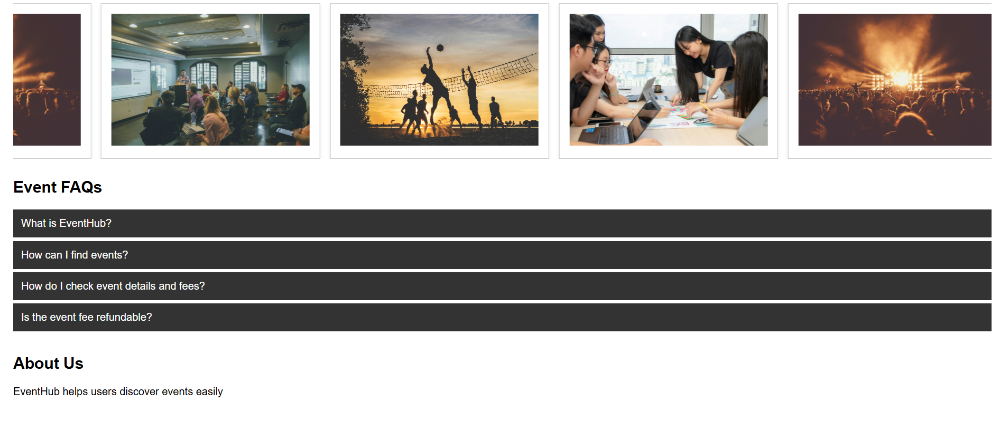
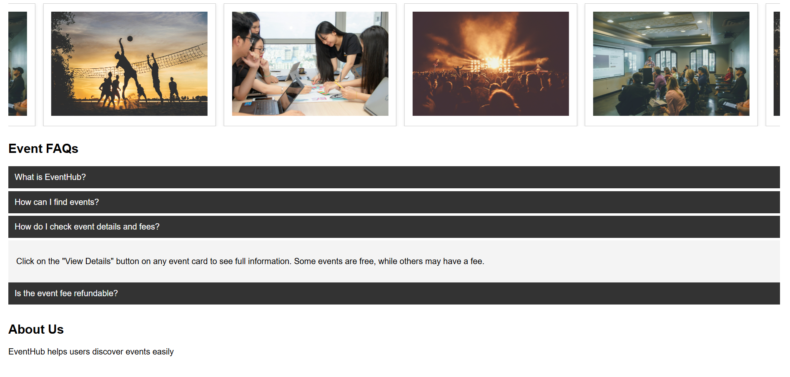

# HTML-08 · CSS Accordion Component

## Objective
Build an accordion component using pure CSS to expand and collapse content sections.

## What I Implemented
- Created an accordion using the checkbox hack (`:checked` pseudo-class)
- Enabled multiple sections to open simultaneously
- Added smooth expand/collapse animation using `max-height`

## Output

### Closed State

### Open State

